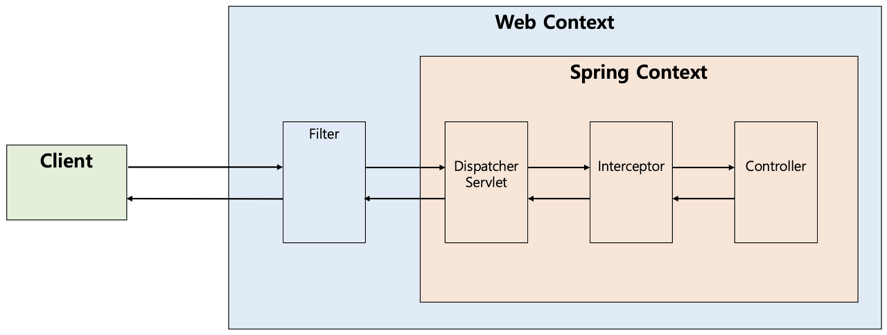
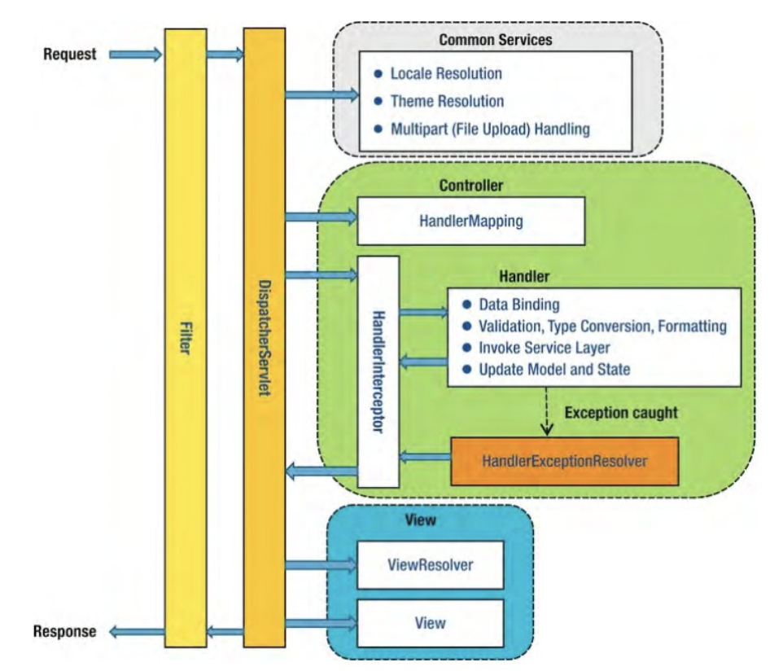

> 이 포스팅의 예제는 [Spring Security 없이 JWT 인증/인가 구현 해보기](https://tech-blog.taewan.co.kr/web-security-without-sprint-security/)와 동일한 예제를 사용합니다. 

  

지난번에 Spring Filter를 이용해 Spring Security를 사용하지 않고 인증, 인가를 구현하였습니다. 

초기엔 큰 문제없이 사용하고 있었지만, 사용하며 발생한 몇 가지 문제점과 여전히 해결하지 못한 몇 가지 불편함을 느낄 수 있었습니다. 

문제점들은 다음과 같습니다. 
1. 발생하는 예외를 핸들링하기 위해 추가적으로 요구되는 `FilterExceptionHandler`
2. 404 Not Found 를 발생하지 못하고 항상 401 Unauthorized 만을 발생시킴 
3. 여전히 복잡하고 귀찮은 설정 

본 포스팅에서는 3번 항목을 제외한 1,2번 항목을 해결한 과정을 다룰 에정입니다. 

  
  

## 발생하는 예외를 핸들링하기 위해 추가적으로 요구되는 FilterExceptionHandler

Spring Filter는 모든 요청을 전처리, 후처리 하는 데 있어 굉장히 유용하게 사용되지만, 한 가지 큰 단점이 존재하였습니다. 
바로 `@RestControllerAdvice` 와 `@ExceptionHandler`에 의한 **예외 핸들링이 불가**하다는 점입니다. 

그 원인은 Spring Filter가 요청을 처리하는 위치에 있습니다.

위 사진에서 알 수 있듯 Filter는 Dispatcher Servlet으로 요청이 전달되기 **전에** 그 기능을 수행합니다. DispatcherServlet보다 앞 단에 위치하고 있기 때문에 이 Filter를 관리하는 곳도 Spring Context가 아니라 톰캣과 같은 Web Context가 되는 것이죠. 

문제는 Filter가 Spring Context에 의해 관리받지 않기 때문에 발생합니다. RestControllerAdvice는 Spring Context내부에서 발생하는 예외들에 대해서만 ExceptionHandler를 제공합니다. 따라서 Web Context에 의해 관리되는 Filter 내부 에서 발생하는 예외는 RestControllerAdvice에 의해 감지되지 못하는 것입니다. 

  

따라서 이전 포스팅에서는 다음과 같이 Filter들의 제일 앞단에 `FilterExceptionHandler`를 두어 별도로 예외를 처리하는 방법을 선택하였습니다.

~~~java
public class AuthFilterExceptionHandler extends OncePerRequestFilter {  
  
    @Override  
    protected void doFilterInternal(  
            HttpServletRequest request,  
            HttpServletResponse response,  
            FilterChain filterChain  
    ) throws ServletException, IOException {  
        try {  
            filterChain.doFilter(request, response);  
        } catch (ApisSecurityException exception) {  
            String responseBody = createErrorResponse(exception.getErrorCode()); 
            sendErrorToClient(response, exception.getErrorCode().getHttpStatus(), responseBody);   
        }  
    }  
  
    private String createErrorResponse(ErrorCode errorCode) {  
        ObjectMapper objectMapper = new ObjectMapper();  
  
        try {  
            ApiResponse errorResponse = ApiResponse.error(errorCode, "ApiSecurityException");  
            return objectMapper.writeValueAsString(errorResponse);  
        } catch (IOException e) {  
            throw new RuntimeException(e);  
        }  
    }  
  
    private void sendErrorToClient(HttpServletResponse response, int status, String responseBody) {  
        response.setContentType(MediaType.APPLICATION_JSON_VALUE);  
        response.setCharacterEncoding("UTF-8");  
        response.setStatus(status);  
  
        try {  
            response.getWriter().write(responseBody);  
        } catch (IOException e) {  
            throw new RuntimeException(e);  
        }  
    }  
}
~~~ 

하지만 필터가 추가된다는 것은 곧 애플리케이션 모듈에 등록해야 하는 작업이 하나 더 추가됨을 의미하기도 하였습니다.

  

## 404 Not Found를 발생하지 못하고 항상 401 Unauthorized만을 발생시킴

다음은 유효하지 않은 `/api/invalid/hahaha` 와 같이 유효하지 않은 요청에도 404가 아닌 401을 반환하는 문제가 발생하였습니다.

이도 마찬가지로 Filter가 요청을 처리하는 위치 때문에 발생하는 문제였습니다.

DispatcherServlet은 요청이 발생하면 발생한 요청의 uri과 등록된 컨트롤러들을 비교하여 적절한 컨트롤러를 매핑해주는 `HandlerMapping`을 제공합니다.  
이때 적절한 컨트롤러를 찾을 수 없으면 `NoHandlerFoundException`즉 404 Not Found를 발생하게 됩니다.

하지만 Filter는 DispatcherServlet의 앞단에서 동작하기 때문에 핸들러 매핑 여부와 관계 없이 모든 요청에 대해 필터 로직을 수행하게 됩니다.
따라서 등록되지 않은 요청에 대해 401을 반환하는 `elseRequestAuthecticated`로 설정해두었을 때 `/api/invalid/hahaha`와 같이 유효하지 않은 url로 요청이 들어와도 등록되지 않는 url로 간주하여 401을 발생하는 것 이었습니다. 

 
 

## Spring Interceptor

이 두 가지 문제를 해결하려면 다음 조건을 모두 충족하는 무엇이 필요했습니다. 

1. Filter과 동일하게 요청 전처리가 가능해야 한다. 
2. Spring Context에 의해 관리되어야 한다. 
3. Dispatcher Servlet보다 뒷 단에서 로직을 수행할 수 있어야 한다. 

그리고 Spring Interceptor가 이 모든 조건을 충족한다는 것을 알 수 있었습니다. 

  

Spring Interceptor는 Spring에서 제공하는 인터페이스로 클라이언트의 요청을 가로채 `preHandle()`, `postHandle()`메서드를 통해 요청의 전처리, 후처리를 할 수 있도록 도와줍니다. 

Filter와 굉장히 유사한 기능을 수행하지만 Filter와 가장 큰 차이점은 **Spring Context에 의해 관리**되며, **DispatcherServlet의 뒷 단**에서 요청을 가로채 처리한다는 특징이 있습니다. 

  

이미 눈치 채신 분들도 있겠지만, 이러한 Spring Interceptor의 특징으로 인해 Filter를 Interceptor로 바꾸는 것 만으로 모든 문제를 해결할 수 있었습니다.

 

1. **발생하는 예외를 핸들링하기 위해 추가적으로 요구되는 FilterExceptionHandler** 
   - Spring Interceptor는 Spring Context에 의해 관리받기 때문에 Interceptor 내부에서 발생하는 모든 예외는 RestControllerAdvice에 의해 핸들링됩니다. 
   - 따라서 예외 처리를 위한 별도의 필터를 설정하지 않아도 RestControllerAdvice애 의해 모든 예외를 처리할 수 있게 됩니다. 

  

1. **404 Not Found를 발생하지 못하고 항상 401 Unauthorized만을 발생시킴** 
   - Spring Interceptor는 DispatcherServlet의 뒷 단에서 요청을 처리하기 때문에 DispatcherServlet에서 HandlerMapping을 실패하는 경우 요청을 더 처리하지 않고 404 Not Found를 발생하게 됩니다. 
   - HandlerMapping에 성공한 요청만 Interceptor로 넘어오기 때문에 유효한 url들에 대해서만 전처리를 할 수 있어, 예측하지 못한 401 Unauthorized가 발생되는 문제를 해결할 수 있습니다.
 
 

## Interceptor로 변경

이제 모든 Filter를 모두 Interceptor로 바꿔보도록 하겠습니다.  
Filter를 사용한 기존 코드는 [여기](https://tech-blog.taewan.co.kr/web-security-without-sprint-security/)서 확인할 수 있습니다.

 

**DecodeTokenInterceptor**
~~~java
@Component
@RequiredArgsConstructor
public class DecodeTokenInterceptor implements HandlerInterceptor {

    /* constatnts */

    private final TokenDecoder tokenDecoder;
    private final TokenValidator tokenValidator;

    @Override
    public boolean preHandle(
            HttpServletRequest request,
            HttpServletResponse response,
            Object handler
    ) {

        decodeToken(request).ifPresent(tokenClaims -> {
            request.setAttribute(USER_EMAIL_ATTRIBUTE_KEY, tokenClaims.userEmail());
            request.setAttribute(USER_ROLE_ATTRIBUTE_KEY, tokenClaims.role());
        });

        return true;
    }

    private Optional<TokenClaims> decodeToken(HttpServletRequest request) {
        String bearerToken = request.getHeader(AUTHORIZATION_HEADER);
        if (!hasToken(bearerToken) || !isValidTokenPrefix(bearerToken)) {
            return Optional.empty();
        }

        String token = bearerToken.substring(AUTHENTICATION_TOKEN_START_INDEX);
        tokenValidator.validateToken(token);
        return Optional.of(tokenDecoder.decode(token));
    }

    private boolean hasToken(String bearerToken) {
        return StringUtils.hasText(bearerToken);
    }

    private boolean isValidTokenPrefix(String bearerToken) {
        return bearerToken.startsWith(AUTHENTICATION_TOKEN_PREFIX);
    }
}

~~~

 

**AuthentocationInterceptor**
~~~java
@Component
@RequiredArgsConstructor
public class AuthenticationInterceptor implements HandlerInterceptor {

    /* constatnts */

    private final AuthorizedRequest authorizedRequest;

    @Override
    public boolean preHandle(
            HttpServletRequest request,
            HttpServletResponse response,
            Object handler
    ) {
        String method = request.getMethod();
        String requestUri = request.getRequestURI();
        String role = readUserRole(request);

        validateUnauthorized(method, requestUri, role);
        validateForbidden(method, requestUri, role);

        return true;
    }

    private String readUserRole(HttpServletRequest request) {
        try {
            return request.getAttribute(USER_ROLE_ATTRIBUTE_KEY).toString();
        } catch (NullPointerException e) {
            return ANONYMOUS_ROLE;
        }
    }

    private void validateUnauthorized(String method, String requestUri, String role) {
        if (hasAuthentication(role) && !canAccess(method, requestUri, role)) {
            throw new ApisSecurityException(HTTP_UNAUTHORIZED);
        }
    }

    private void validateForbidden(String method, String requestUri, String role) {
        if (!hasAuthentication(role) && !canAccess(method, requestUri, role)) {
            throw new ApisSecurityException(HTTP_FORBIDDEN);
        }
    }

    private boolean hasAuthentication(String role) {
        return role.equals(ANONYMOUS_ROLE);
    }

    private boolean canAccess(String method, String requestUri, String role) {
        return authorizedRequest.isAccessibleRequest(method, requestUri, role);
    }
}
~~~

 

**AppConfig**
~~~java
@Configuration
@RequiredArgsConstructor
public class SecurityInterceptorRegistrar implements WebMvcConfigurer {

    private final DecodeTokenInterceptor decodeTokenInterceptor;
    private final AuthenticationInterceptor authenticationInterceptor;

    @Override
    public void addInterceptors(InterceptorRegistry registry) {
        registry.addInterceptor(decodeTokenInterceptor);
        registry.addInterceptor(authenticationInterceptor);
    }
}
~~~
~~~java
@Configuration
public class SsoAppSecurityConfig {

    @Bean
    public AuthorizedRequest authorizedRequest() {
        return AuthorizedRequestBuilder.withPatterns()
                .antMatchers(
                        allHttpMethods(),
                        uriPatterns("/docs/**"),
                        permitAll()
                )
                .antMatchers(
                        httpMethods(HttpMethod.POST),
                        uriPatterns("/api/auth/login", "/api/auth/signup", "/api/auth/signup/email"),
                        permitAll()
                )
                .antMatchers(
                        httpMethods(HttpMethod.GET),
                        uriPatterns("/api/auth/role"),
                        authenticated()
                )
                .elseRequestAuthenticated();
    }
}
~~~
_* 설정을 두 개의 클래스로 분리해야 하는 이유는 별도의 포스팅을 통해 다뤄보겠습니다._ 

  
  

## 마치며 
단순히 `Filter`를 `Interceptor`로 바꾸는 것으로 세 개의 문제 중 두 개의 문제를 해결할 수 있었습니다. 
문제를 해결하기 위해 새로운 것을 탐구하고 적용하는 것보다 기존에 사용하던 기술의 특징을 보다 깊이 이해하고 적용하는 것이 더욱 중요하다는 것을 느낀 경험이었습니다. 

하지만 여전히 두 개의 인터셉터를 등록해야 하는 과정이 좋은 경험으로 다가오진 않습니다. 
다음 포스팅에선 이 불편한 설정들을 조금이나마 간편하게 만들었던 경험을 공유해 보도록 하겠습니다.
