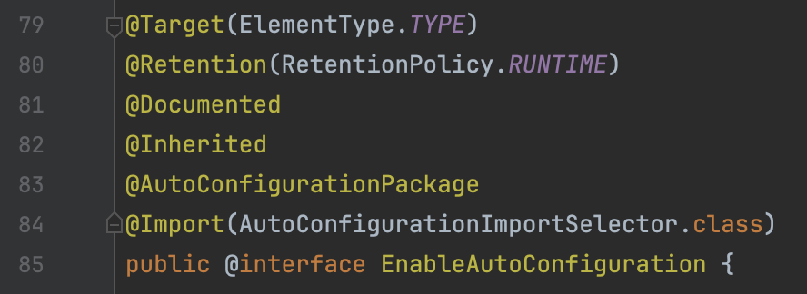

> 이 포스팅은 이전 포스팅과 동일한 예제를 사용합니다.
> 1.  [Spring Security 없이 JWT 인증/인가 구현 해보기](https://tech-blog.taewan.co.kr/web-security-without-sprint-security/)
> 2.  [spring filter를 interceptor로 바꿔보자](https://tech-blog.taewan.co.kr/spring-filter-and-interceptor/)

 

[지난 포스팅](https://tech-blog.taewan.co.kr/spring-filter-and-interceptor/)에서 `Spring Interceptor`를 이용해 다음 세 가지 문제 중 1, 2번 문제를 해결할 수 있었습니다.

1. ~~발생하는 예외를 핸들링하기 위해 추가적으로 요구되는 `FilterExceptionHandler`~~
2. ~~404 Not Found 를 발생하지 못하고 항상 401 Unauthorized 만을 발생시킴~~
3. 여전히 복잡하고 귀찮은 설정

하지만 여전히 복잡한 설정 문제는 해결하지 못하였고, 이번 포스팅을 통해 남아있는 문제를 해결해 보도록 하겠습니다.

  

## 여전히 복잡하고 귀찮은 설정

저의 security 모듈을 사용하기 위해선 다음 두 가지 인터셉터를 스프링 컨텍스트에 등록한 후, 각 요청에 대한 권한 설정을 모두 해주어야 합니다.

아래 코드는 기존에 사용하던 설정 클래스로 Security 모듈을 사용하는 모든 Application 모듈이 다음과 같은 설정을 가져야만 했습니다.

~~~java
@Configuration
@RequiredArgsConstructor
public class SecurityInterceptorRegistrar implements WebMvcConfigurer {

    private final DecodeTokenInterceptor decodeTokenInterceptor;
    private final AuthenticationInterceptor authenticationInterceptor;

    @Override
    public void addInterceptors(InterceptorRegistry registry) {
        registry.addInterceptor(decodeTokenInterceptor);
        registry.addInterceptor(authenticationInterceptor);
    }
}
~~~
~~~java
@Configuration
public class AppSecurityConfig {

    @Bean
    public AuthorizedRequest authorizedRequest() {
        return AuthorizedRequestBuilder.withPatterns()
                .antMatchers(
                        allHttpMethods(),
                        uriPatterns("/docs/**"),
                        permitAll()
                )
                .antMatchers(
                        httpMethods(HttpMethod.POST),
                        uriPatterns("/api/auth/login", "/api/auth/signup", "/api/auth/signup/email"),
                        permitAll()
                )
                .antMatchers(
                        httpMethods(HttpMethod.GET),
                        uriPatterns("/api/auth/role"),
                        authenticated()
                )
                .elseRequestAuthenticated();
    }
}
~~~

아래 `AuthorizedRequest`를 빈으로 등록하는 과정은 모듈마다 관리해야하는 요청이 상이하기 때문에 모듈마다 별도로 관리하는 것이 당연합니다.  
하지만 위 두 `Interceptor`를 등록하는 과정은 모든 모듈이 정확히 동일한 코드를 사용하게 되어 굉장히 비효율적이라고 느꼈습니다.

  

## Spring Auto Configuration

이 문제를 해결하고자 한 순간 Jpa에서 사용하는 `@EnableJpaRepository`라는 어노테이션이 떠올랐습니다.

`Spring Auto Confiruation`은 **일반적으로 많이 사용하는 수많은 빈을 자동으로 등록**해주기 위한 스프링의 대표적인 기능입니다.  
configuration클래스 위에 어노테이션을 추가하는 것 만으로 빈 등록을 자동으로 해주는데, 이때 이 어노테이션의 일반적인 네이밍이 `@Enable***`인 것입니다.

@SpringBootApplication을 살펴보면 `@EnableAutoConfiguration`이 있는 것을 확인할 수 있는데, 이 어노테이션으로 인해 다양한 빈을 추가적인 설정 없이 사용할 수 있는 것입니다.

 

여기서 @EnableAutoConfiguration은 `@Import`를 통해 `AutoConfigurationImportSelector.class`를 임포트 하고 있어 그 안에 정의된 설정 내용을 그대로 적용시켜 줍니다.

  

## @EnableWebSecurity

저는 위에서 본 것과 같이 귀찮고 반복되는 두 인터셉터의 등록 과정을 @EnableWebSecurity라는 Auto Configurer를 정의하는 것으로 보다 간편하게 만들 수 있었습니다.

 

~~~java
@RequiredArgsConstructor
public class SecurityInterceptorRegistrar implements WebMvcConfigurer {

    private final DecodeTokenInterceptor decodeTokenInterceptor;
    private final AuthenticationInterceptor authenticationInterceptor;

    @Override
    public void addInterceptors(InterceptorRegistry registry) {
        registry.addInterceptor(decodeTokenInterceptor);
        registry.addInterceptor(authenticationInterceptor);
    }
}
~~~

우선 각 Application 모듈에 위치한 인터셉터 Registrar 클래스를 Security모듈로 옮겨주었습니다.  
또한 원치 않는 상황에 스프링이 Registrar를 빈으로 등록하는 것을 방지하기 위해 @Configuration 어노테이션을 제거해 주었습니다.

 

~~~java
@Retention(RetentionPolicy.RUNTIME)
@Target({ElementType.TYPE})
@Import({SecurityInterceptorRegistrar.class})
public @interface EnableWebSecurity {
}
~~~

`@EnableWebSecurity`를 정의한 뒤 Security모듈로 옮긴 SecurityInterceptorRegistrar를 임포트 해주었습니다.

 

각 Application 모듈에서는 다음과 같이 @EnableWebSecurity만으로 간단하게 설정을 마칠 수 있습니다.

~~~java
@Configuration
@EnableWebSecurity
public class AppSecurityConfig {

    @Bean
    public AuthorizedRequest authorizedRequest() {
        return AuthorizedRequestBuilder.withPatterns()
                .antMatchers(
                        allHttpMethods(),
                        uriPatterns("/docs/**"),
                        permitAll()
                )
                .antMatchers(
                        httpMethods(HttpMethod.POST),
                        uriPatterns("/api/auth/login", "/api/auth/signup", "/api/auth/signup/email"),
                        permitAll()
                )
                .antMatchers(
                        httpMethods(HttpMethod.GET),
                        uriPatterns("/api/auth/role"),
                        authenticated()
                )
                .elseRequestAuthenticated();
    }
}
~~~

 
 

## 마치며

이전 코드와 비교하여 눈에 띄게 간결하진 설정 클래스와, 사라진 반복작업을 확인할 수 있습니다.  

하지만 AuthenticationInterceptor가 AuthorizedRequest의 의존하는 구조이기 때문에 개발자가 신경 써서 AuthorizedRequest를 빈으로 등록해 주지 않는다면 `BeanCreationException`이 발생하게 됩니다.  

또한 모듈에서 Security 모듈 의존성을 가지지만 @EnableWebSecurity를 사용하지 않는 모듈에서도 각 인러셉터들은 @Component애 의해 자동으로 스캔되어 빈으로 등록됩니다. 이처럼 사용하지 않는 빈을 IOC에 가지고 있는 것은 불필요한 리소스의 낭비입니다.

다음 포스팅에서는 AuthorizedRequest의 빈 등록을 강제하고, 불필요한 빈 생성으로 인해 발생하는 리소스 낭비를 해결하는 방법을 공유해 보겠습니다.
