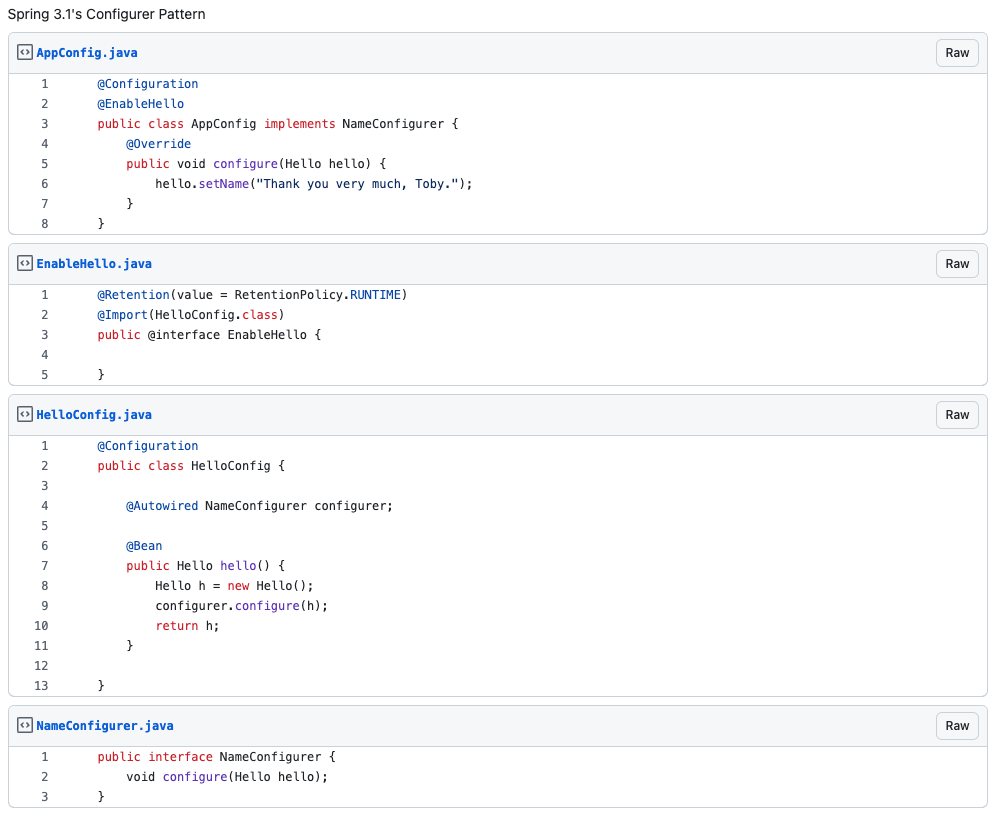

> 이 포스팅은 이전 포스팅과 동일한 예제를 사용합니다.
> 1.  [Spring Security 없이 JWT 인증/인가 구현 해보기](https://tech-blog.taewan.co.kr/1003/)
> 2.  [spring filter를 interceptor로 바꿔보자](https://tech-blog.taewan.co.kr/1004/)
> 3.  [복잡한 Spring Configuration을 더욱 쉽게 관리 하는 법. (1)](https://tech-blog.taewan.co.kr/1005/)

 

[지난 포스팅](https://tech-blog.taewan.co.kr/1005/)를 에서 Spring Auto Configure을 이용해 복잡한 설정을 어노테이션 하나로 해결해 보았습니다.

 

하지만 AuthorizedRequest를 빈으로 등록해 주지 않으면 빈 사이의 의존 관계로 인해 `BeanCreationException`을 발생하고 스프링 어플리케이션을 실행할 수 없다는 문제가 발생합니다.

Security 모듈의 구현을 맡은 개발자가 어플리케이션 모듈의 개발까지 맡는다면 아무 문제 없이 설정을 마칠 수 있을 것입니다. 
다만 다른 개발자가 어플리케이션 모듈의 개발을 해야 한다면 빈 사이의 의존관계를 파악하기 위해 모듈 내부의 구현 들여다볼 수밖에 없을 것입니다.

  

## 설정의 추상화

이 문제를 해결하려면 개발자에게 일종의 '**가이드**'를 제공해야 한다고 생각하였습니다.  
저는 그 가이드의 한 종류로 `인터페이스`를 선택해 개발자로 하여금 구현을 강제시키고자 하였습니다.

 

### 첫 번째 시도

~~~java
public interface WebSecurityConfigurer {
    AuthorizedRequest authorizedRequest();
}
~~~

처음으로 다음과 같은 방법으로 인터페이스를 제공하였습니다.
위 인터페이스를 이용한 어플리케이션 모듈의 모습은 다음과 같았습니다.

~~~java
@Configuration
@EnableWebSecurity
public class AppSecurityConfig implements WebSecurityConfigurer {

    @Bean
    @Override
    public AuthorizedRequest authorizedRequest() {
        return AuthorizedRequestBuilder.withPatterns() 
            .antMatchers(  
                    httpMethods(HttpMethod.POST),  
                    uriPatterns("/api/auth/login", "/api/auth/signup", "/api/auth/signup/email"),  
                    permitAll()  
            )
            .antMatchers(  
                    httpMethods(HttpMethod.GET),  
                    uriPatterns("/api/auth/example"),  
                    hasRoles(ROLE_ADMIN, ROLE_BASIC_USER)  
            ) 
            .elseRequestAuthenticated();  
    }
}
~~~

'AuthorizedRequest를 반환하는 어떤 함수를 작성하라'라는 대략적인 가이드는 제공된 것 같습니다.

하지만 '그걸 빈으로 등록해야 해'라는 추가적인 가이드는 제공되지 않는 모습입니다. 인터페이스를 구현하는 것 만으로 빈 등록까지 해주면 좋을 것 같다는 생각이 듭니다.

 

### 두 번째 시도

빈 등록까지 해준다면 좋겠다는 요구사항이 발생했으니, AuthorizedRequest를 빈으로 등록하고 그 빈을 Configurer로 넘겨 설정 정보를 받아야겠다는 생각을 하였습니다.

~~~java
public class AuthorizedRequestRegistrar {

    @Bean
    public AuthorizedRequest authorizedRequest() {
        return AuthorizedRequestBuilder.withPatterns()
            .elseRequestPermit();  
}
~~~
~~~java
public interface WebSecurityConfigurer {
    void addPatterns(AuthorizedRequest authorizedRequest);
}
~~~

 

~~~java
@Configuration
@EnableWebSecurity
public class AppSecurityConfig implements WebSecurityConfigurer {

    @Override
    public void addPatterns(AuthorizedRequest authorizedRequest) {
        authorizedRequest
            .antMatchers(  
                    httpMethods(HttpMethod.POST),  
                    uriPatterns("/api/auth/login", "/api/auth/signup", "/api/auth/signup/email"),  
                    permitAll()  
            )
            .antMatchers(  
                    httpMethods(HttpMethod.GET),  
                    uriPatterns("/api/auth/example"),  
                    hasRoles(ROLE_ADMIN, ROLE_BASIC_USER)  
            ) 
            .elseRequestAuthenticated();  
    }
}
~~~

어리석은 생각이었습니다.  

AuthorizedRequest를 빈으로 등록하는 데에는 성공하였지만, 등록된 빈에 설정 정보를 주입해주는 `WebSecurityConfigurer.addPatterns()`는 실행되지 않아 빈 설정 정보만 남아있었습니다.

`addPatterns()`는 `WebSecurityConfigurer`라는 @Configure 내부에 있지만 별도로 스프링 빈으로 등록하지 않았기 때문에 그 내부의 동작을 수행하지 않아 설정 정보가 전달되지 않았던 것입니다.

  

## Configurer Pattern

[지난 포스팅](https://tech-blog.taewan.co.kr/1005/)의 인터셉터 등록 과정을 자세히 보면 

~~~java
@Configuration
public class InterceptorRegistrar implements WebMvcConfigurer {

    @Override
    public void addInterceptors(InterceptorRegistry registry) {
        registry.addInterceptor(new ExampleInterceptor());
    }
}
~~~

`InterceptorRegistry`에 `addInterceptor()`에 인터셉터를 전달하는 것 만으로 빈과 InterceptorRegistrations에 등록되어 인터셉터로 동작할 수 있게 됩니다.

 

어떤 키워드로 검색해야 할지 조차 모르겠던 와중 `Configurer Pattern`라는 키워드로 [백기선 님이 작성하신 코드](https://gist.github.com/keesun/1633571)을 보게 되었습니다.

사진은 위 코드를 발췌해 온 것으로 간단히 요약하면 다음과 같습니다.

1. `hello`라는 새 객체 생성
2. NameConfigurer라는 인터페이스를 구현한 AppConfig의 `configure()` 실행
3. 실행 이후의 hello 객체를 반환하며 빈으로 등록
4. 빈으로 등록된 `hello`는 `configure()`에서 설정한 모든 정보를 갖고 있다

 

'모든 설정 정보를 가지는 빈을 자동으로 등록 해준다'라는 요구사항을 모두 충족시켜 줄 수 있기에 당장 위 예제를 적용해 보았습니다.

(위 과정에서 AuthorizedRequest와 AuthorizedRequestBuilder에 약간의 리펙토링이 있었으나 위 코드에 대한 설명은 생략하겠습니다. [코드 보기](https://github.com/grida-diary/grida-server/blob/main/grida-apis/apis-security/src/main/java/org/grida/authorizedrequest/AuthorizedRequest.java))

~~~java
public class AuthorizedRequestRegistrar {

    private final WebSecurityConfigurer configurer;

    public AuthorizedRequestRegistrar(WebSecurityConfigurer configurer) {
        this.configurer = configurer;
    }

    @Bean
    public AuthorizedRequest authorizedRequest() {
        AuthorizedRequestFactory factory = AuthorizedRequestFactory.of();
        configurer.addPatterns(factory);
        return AuthorizedRequestApplier.apply(factory);
    }
}
~~~

~~~java
public interface WebSecurityConfigurer {
    void addPatterns(AuthorizedRequestFactory factory);
}
~~~

~~~java
@Retention(RetentionPolicy.RUNTIME)
@Target({ElementType.TYPE})
@Import({SecurityInterceptorRegistrar.class, AuthorizedRequestRegistrar.class})
public @interface EnableWebSecurity {
}
~~~

 

~~~java
@Configuration
@EnableWebSecurity
public class AppSecurityConfig implements WebSecurityConfigurer {

    @Override
    public void addPatterns(AuthorizedRequestFactory factory) {
        factory
                .uriPatterns("/api/auth/login", "/api/auth/signup", "/api/auth/signup/email")
                .httpMethodPost()
                .permitAll()

                .uriPatterns("/api/auth/role")
                .httpMethodGet()
                .authenticated()

                .elseRequestAuthenticated();
    }
}
~~~

AppSecurityConfig의 모습을 보면 제법 친절한 가이드를 재공 받은 것으로 보입니다.
어떤 구현을 추가로 해야 하는지도 알려주고 있으며, 알아서 빈으로 등록도 해주고 있습니다.

여전히 '`@EnableWebSecurity`를 사용해야 한다는 것', '`WebSecurityConfigurer`의 구현을 해야 한다는 것'을 개발자가 알고 있어야 하긴 합니다. 
하지만 이제 영문도 모른 채 발생하는 빈 의존성 문제를 해결하기 위해 모듈 내부의 구현까지 뜯어볼 필요는 훨씬 줄어들었습니다.

 
 

### 나아가

~~~java
@Component
@ConditionalOnBean(value = {WebSecurityConfigurer.class})
@RequiredArgsConstructor
public class AuthenticationInterceptor implements HandlerInterceptor {
    ...
}
~~~
~~~java
@Component
@ConditionalOnBean(value = {WebSecurityConfigurer.class})
@RequiredArgsConstructor
public class DecodeTokenInterceptor implements HandlerInterceptor {
    ...
}
~~~

각 인터셉터들에 `@ConditionalOnBean(value = {WebSecurityConfigurer.class})`이라는 어노테이션을 추가로 달아주었습니다.

@ConditionalOnBean은 value로 전달되는 빈이 있는 경우에만 빈으로 생성한다는 의미로, WebSecurityConfigurer를 구현한 Configuration클래스가 없으면 위 인터셉터들을 빈으로 등록하지 않는다는 뜻입니다.

따라서 Security 의존성을 갖고 있지만 @EnableWebSecurity와 WebSecurityConfigurer를 사용하지 않는 경우 불필요한 빈의 생성을 막아 리소스를 보다 효율적으로 사용할 수 있게 됩니다.

또한 WebSecurityConfigurer에서 AuthorizedRequest를 생성하고, AuthenticationInterceptor는 AuthorizedRequest를 의존성으로 갖고 있기 때문에 
`BeanCreationException`을 방지할 수 있는 또 하나의 수단이 추가되었다고 할 수 있습니다.

 
 

### 마치며

`Congifurar Pattern` 이라 불리우는 이 패턴은 WebMvcConfigurar와 같이 스프링의 기본적인 설정을 하는 과정에서 많이 접할 수 있는 패턴입니다. 

이처럼 스프링이 개발자에게 보다 편한 개발 경험을 제공하기 다양한 패턴들을 공부하는 것도 큰 도움이 될 것이라고 느낄 수 있었습니다.
