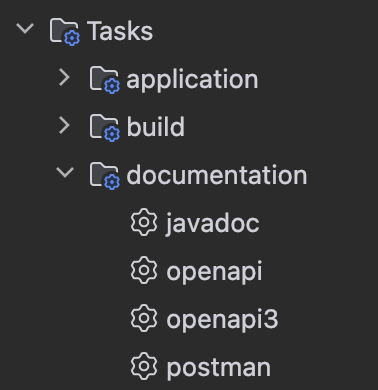
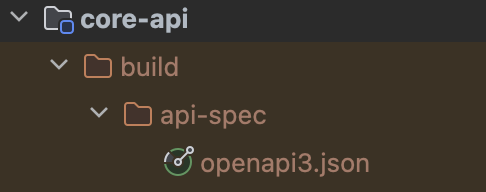
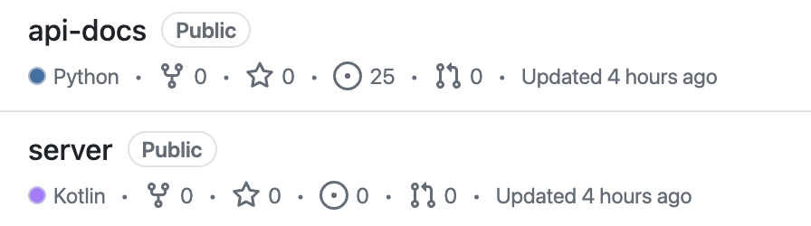
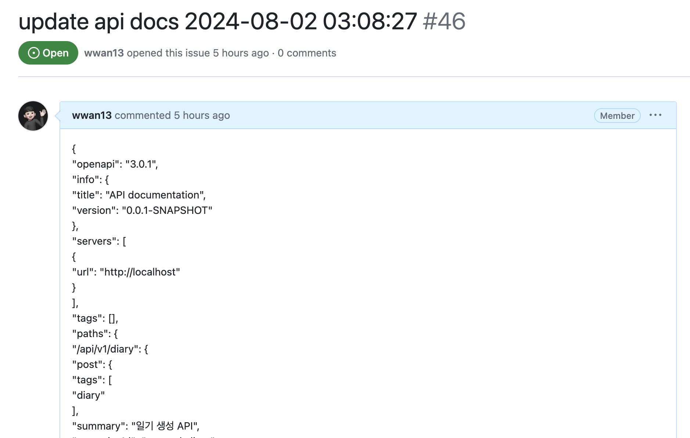

API 문서는 개발된 백앤드 API를 프론트앤드 개발자애개 전달하기 위해 필수적입니다.  
이때 문서를 직접 쓰며 발생하는 많은 비용을 줄이기 위해 `Swagger` 혹은 `Spring Rest Docs`를 이용해 API 문서를 제작하곤 합니다.  
하지만 이 두 라이브러리들은 각각의 장, 단점이 존재합니다. 이번 시간엔 제가 느낀 각 라이브러리들의 불편한 점과, 이를 해결하고 배포 자동화 시스템을 구축한 과정을 공유해 보려고 합니다.

<br/>

## Swagger 그리고 Spring Rest Docs

Swagger와 Spring Rest Docs 모두 API 문서를 제작하기 위한 도구입니다.  

Swagger는 간단한 설정과, 어노테이션 만으로 문서를 보다 손쉽게 문서 제작을 할 수 있으며, 아래 Spring Rest Docs에 비해 깔끔한 UI를 제공합니다.  
Spring Rest Docs는 테스트코드를 기반으로 API 문서를 제작하여 운영코드에 침투하지 않고, 테스트를 기반으로 하기 때문에 보다 신뢰도 높은 문서를 제작할 수 있다는 장점이 있습니다.

<br/>

하지만 이 두 라이브러리 모두 사용하면서 느꼈던 치명적인 단점이 존재하였습니다.

**Swagger**
- 더욱 자세한 정보를 제공하려면 운영 코드(Controller, DTO 등)에 swagger와 관련된 어노테이션이 다수 추가된다.

**Spring Rest Docs**
- 매번 생성된 Snippet을 조합하는 과정이 필요하다.
- 프로잭트에 많은 양의 html(api 문서)파일이 포함되어 그 크기가 비대해진다.
- 문서의 가독성이 swagger에 비해 떨어진다.

<br/>

따라서 저는 다음과 같은 조건을 가지는 API 문서 제작 도구가 필요하였습니다.
- API 문서 관련 코드가 운영 코드에 침투하지 않아야 함.
- 매번 Snippet을 조합하는 과정이 자동화되어야 함, 혹은 없어야 함.
- 프로젝트에 html 파일이 포함되면 안 됨.
- Swagger에 준하는 가독성을 가져야 함.

<br/>

## OpenApi Specification 3.0 (OAS3)

OAS3은 REST API의 스펙을 yml과 json의 형태로 정의한 것으로 오늘날 사실상 표준으로서 사용되고 있습니다.  
API 스펙이 정의된 .yml/.json 파일은 Swagger-Ui를 이용해 이를 시각화할 수 있습니다.  

이에 대한 자세한 예시는 아래 에디터를 통해 확인할 수 있습니다.  
[https://editor.swagger.io/](https://editor.swagger.io/)  

<br/>

Spring에서는 플러그인과 gradle 명령어를 이용해 Spring Rest Docs로 작성한 테스트를 OAS3 스펙에 맞는 형태로 추출할 수 있습니다.

~~~ kotlin
// build.gradle.kts
plugins {
    id("com.epages.restdocs-api-spec") version "0.16.0"
}
~~~

위와 같이 `restdocs-api-spec` 플러그인을 추가해 주면 아래 사진처럼 Tasks/documentation 에 문서 추출을 위한 각종 task가 추가된 것을 확인할 수 있습니다.



이후 별도의 설정 없이 `openapi3` task를 실행하면 다음과 같이 build/api-spec 아래에 `openapi3.json` 파일이 생성된 것을 확인할 수 있습니다.   
> `$ gradle openapi3` 명령어로도 동일한 동작을 수행할 수 있습니다.


openapi3.json 파일 내부에는 우리가 Spring Rest Docs를 이용해 작성한 정보가 OAS3 스펙에 맞는 형식으로 추출되어 있는 것을 볼 수 있습니다.
<details>
<summary>ex) openapi3.json</summary>

~~~json
{
  "openapi" : "3.0.1",
  "info" : {
    "title" : "API documentation",
    "version" : "0.0.1-SNAPSHOT"
  },
  "servers" : [ {
    "url" : "http://localhost"
  } ],
  "tags" : [ ],
  "paths" : {
    "/api/v1/auth/login" : {
      "post" : {
        "tags" : [ "auth" ],
        "summary" : "로그인 API",
        "operationId" : "login",
        "requestBody" : {
          "content" : {
            "application/json;charset=utf-8" : {
              "schema" : {
                "$ref" : "#/components/schemas/api-v1-auth-login-1089546234"
              },
              "examples" : {
                "login" : {
                  "value" : "{\"username\":\"username\",\"password\":\"password\"}"
                }
              }
            }
          }
        },
        "responses" : {
          "200" : {
            "description" : "200",
            "content" : {
              "application/json" : {
                "schema" : {
                  "$ref" : "#/components/schemas/api-v1-auth-login638935618"
                },
                "examples" : {
                  "login" : {
                    "value" : "{\"status\":\"SUCCESS\",\"data\":{\"accessToken\":\"access token\",\"refreshToken\":\"refresh token\"},\"timestamp\":\"2024-08-02 15:56:42\"}"
                  }
                }
              }
            }
          }
        }
      }
    },
  },
  "components" : {
    "schemas" : {
      "api-v1-auth-login-1089546234" : {
        "type" : "object",
        "properties" : {
          "password" : {
            "type" : "string",
            "description" : "유저 비밀번호"
          },
          "username" : {
            "type" : "string",
            "description" : "유저 아이디"
          }
        }
      },
      "api-v1-auth-login638935618" : {
        "type" : "object",
        "properties" : {
          "data" : {
            "type" : "object",
            "properties" : {
              "accessToken" : {
                "type" : "string",
                "description" : "인증 토큰"
              },
              "refreshToken" : {
                "type" : "string",
                "description" : "재발급 토큰"
              }
            },
            "description" : "응답 데이터"
          },
          "timestamp" : {
            "type" : "string",
            "description" : "응답 시간"
          },
          "status" : {
            "type" : "string",
            "description" : "응답 상태"
          }
        }
      }
    }
  }
}
~~~
</details>

<br/>

build.gradle.kts 에서 문서 제목, 설명, 서버 등 각종 기본 정보를 설정할 수 있지만 그 범위가 제한되고,   
kotlin dsl 환경에선 두 개 이상의 서버 설정이 어렵기 때문에 여기선 설정하지 않고 이후에 다른 방법으로 메타 정보를 설정하겠습니다.

<br/>

## 구현

지금까지 간단한 명령어 만으로 테스트로 작성한 API의 정보를 OAS3 스펙을 만족하는 json 파일을 추출하는 방법을 알아보았습니다.

이제 추출된 json 파일을 이용해 API 문서를 제작하고 배포하는 과정을 알아보겠습니다.

우선 이 방법을 사용하려면 다음과 같이 api-docs만을 관리하는 별도의 저장소를 생성해 주어야 합니다.


<br/>

구현은 다음과 같은 방법으로 진행됩니다.
1. server 저장소의 docs 브랜치로 merge될 때 openapi3.json을 추출한다.
2. 추출된 openapi3.json 에 포함된 모든 내용을 담아 api-docs 저장소로 issue를 생성한다.
3. api-docs 저장소에서 issue 생성이 감지되면 사전 정의된 meta-data와 통합한 swagger.json 파일을 생성한다.
4. api-docs 저장소의 내용을 github-pages를 통해 호스팅 한다.

<br/>

## api-docs 저장소 셋업

앞서 말씀드린 내용과 같이 Swagger 에서는 Swagger-Ui 를 이용해 OAS3 스펙의 파일을 시각화하는 기능을 제공하고 있습니다.

### index.html
```html
<html>
    <head>
        <script src="https://unpkg.com/swagger-ui-dist@3/swagger-ui-bundle.js"></script>
        <link rel="stylesheet" type="text/css" href="https://unpkg.com/swagger-ui-dist@3/swagger-ui.css"/>
        <title>Grida Diary API Document</title>
    </head>
    <body>
        <div id="swagger-ui"></div>
        <script>
            window.onload = function () {
                const ui = SwaggerUIBundle({
                    url: "swagger.json",
                    dom_id: '#swagger-ui',
                    deepLinking: true,
                    presets: [
                        SwaggerUIBundle.presets.apis,
                        SwaggerUIBundle.SwaggerUIStandalonePreset
                    ],
                    plugins: [
                        SwaggerUIBundle.plugins.DownloadUrl
                    ],
                })
                window.ui = ui
            }
        </script>
    </body>
</html>
```

다음과 같이 단순한 html 파일에 swagger.json의 url만 잘 설정해 준다면 간단하게 시각화 기능을 사용할 수 있습니다.
> 이때 github-pages의 정적 호스팅 서비스를 이용하려면 파일 이름을 반드시 index.html로 설정해 주어야 합니다.

<br/>

### meta-data.json
~~~ json
{
  "info": {
    "title": "Grida Core API",
    "description": "",
    "version": "1.0.0-SNAPSHOT"
  },
  "servers": [
    {
      "url": "http://localhost:8080",
      "description": "local server"
    },
    {
      "url": "https://liveserver.com",
      "description": "live server"
    }
  ],
  "authorize": {
    "enable": true,
    "securitySchemes": {
      "bearerAuth": {
        "type": "http",
        "scheme": "bearer",
        "bearerFormat": "JWT"
      }
    },
    "security": [
      {
        "bearerAuth": []
      }
    ]
  }
}
~~~

앞에서 설정하지 않았던 meta-data 설정을 이곳에서 해줍니다.  
이 설정은 Swagger에서 기본으로 제공하는 기능이 아니며, 추후에 python 스크립트를 통해 해당 내용을 추가해 줄 예정입니다.

<br/>

## OAS3 추출, Issus 생성

먼저 server 저장소의 docs 브랜치로 merge 될 때 openapi3.json을 추출하고, 그 내용울 담은 Issue를 생성해 주는 작업을 해야 합니다.  
shell, python 등의 선택지가 있었으나 python에 대한 이해도가 그나마 높기 때문에 python을 선택하였습니다.

> 기능 동작에 초점을 두고 작성한 코드로, 코드의 품질이 좋지 않을 수 있습니다.

<br/>

### export_oas.py

openapi3.json 생성, issue 생성을 담당하는 python 스크립트입니다.

~~~ python
import json
import os
import requests
import sys
import time

if len(sys.argv) == 1:
    print("no system arguments")
    exit()

GH_TOKEN = sys.argv[1] # 시스템 변수로 주입 Github Token 주입

GH_API_BASED_HEADERS = { # Github Api 기본 헤더
    "Authorization": "Bearer {}".format(GH_TOKEN),
    "X-GitHub-Api-Version": "2022-11-28",
    "Accept": "application/vnd.github+json"
}

os.system("gradle :grida-core:core-api:clean") # 스프링 프로젝트(모듈) clean
os.system("gradle :grida-core:core-api:openapi3") # openapi3.json 생성
 
with open("./grida-core/core-api/build/api-spec/openapi3.json", "r") as oas: 
    json_data = json.load(oas) # openapi3.json 읽기

    create_issue_endpoint = "https://api.github.com/repos/grida-diary/api-docs/issues"

    body = {
        "title": "update api docs " + time.strftime('%Y-%m-%d %H:%M:%S'),
        "body": json.dumps(json_data, ensure_ascii=False, indent="\t")
    }

    response = requests.post( # api-docs 저장소로 issue 생성
        create_issue_endpoint,
        headers=GH_API_BASED_HEADERS,
        data=json.dumps(body)
    ).json()
~~~

<br/>

### docs.yml

docs 브랜치 병합 시 동작하는 github actions 입니다.

~~~yml
name: Docs

on:
  push:
    branches: [ "docs" ]

jobs:
  export-oas:
    runs-on: ubuntu-latest

    steps:
      - name: setup java
        uses: actions/setup-java@v3
        with:
          distribution: 'corretto'
          java-version: '17'
      - uses: actions/checkout@v4
      - name: Set up Python 3.10
        uses: actions/setup-python@v5
        with:
          python-version: "3.10"
          cache: 'pip'
      - run: pip install requests
      - run: python3 ./scripts/export_oas.py ${{ secrets.GH_TOKEN }}
~~~

겉으로 보기엔 python만 실행하는 것으로 보일 수 있지만, python 스크립트 내에서 gradle 명령어를 호출하기 때문에 python, java 모두 셋업 해주어야 합니다.

이 과정을 거치면 다음과 같이 api-docs 저장소에 issue가 생성되는 것을 확인할 수 있습니다.  


<br/>

## api-docs 저장소 최신화

API 문서의 내용을 담은 이슈가 생성되었으니 이제 이 이슈의 내용으로 api-docs 저장소 내의 swagger.json 을 수정해 주어야 합니다.  
해당 작업은 위와 동일한 이유로 python으로 구현하였습니다.

### update_swagger.py
~~~ python
import json
import os
import requests
import sys
import time

if len(sys.argv) == 1:
    print("no system arguments")
    exit()

GH_TOKEN = sys.argv[1]

GH_API_BASED_URL = "https://api.github.com"
GH_API_BASED_HEADERS = {
    "Authorization": "Bearer {}".format(GH_TOKEN),
    "X-GitHub-Api-Version": "2022-11-28",
    "Accept": "application/vnd.github+json"
}


def get_recent_issue(): # 가장 최근에 생성된 issue 불러오기
    endpoint = GH_API_BASED_URL + "/repos/grida-diary/api-docs/issues"
    parameters = {"per_page": 1, "page": 1}
    response = requests.get(
        endpoint,
        headers=GH_API_BASED_HEADERS,
        params=parameters
    ).json()

    return response[0]["body"]


def write_swagger_json(issue_body): # 이슈 내용을 읽은 후 meta-data와 통합하여 swagger.json 최신화
    with open("./meta-data.json", "r") as meta:
        meta_data = json.load(meta)

        json_data = json.loads(issue_body)
        json_data["info"] = meta_data["info"]
        json_data["info"]["description"] = "last updated : " + time.strftime('%Y-%m-%d %H:%M:%S')
        json_data["servers"] = meta_data["servers"]

        if meta_data["authorize"]["enable"]:
            json_data["components"]["securitySchemes"] = meta_data["authorize"]["securitySchemes"]
            json_data["security"] = meta_data["authorize"]["security"]

        if os.path.isfile("./swagger.json"):
            os.remove("./swagger.json")

        with open("./swagger.json", "w", encoding="utf-8") as swagger:
            json.dump(json_data, swagger, ensure_ascii=False, indent="\t")


issue = get_recent_issue()
write_swagger_json(issue)
~~~

<br/>

### update_api_docs.yml

마지막 단계입니다.   
동작할 스크립트도 구현되었으니 issue가 생성될 때 위 스크립트를 동작시켜 줄 github action을 작성해 줍니다.
파이썬 스크립트를 통해 수정된 swagger.json의 내용을 원격 저장소로 commit-push 해주는 작업 또한 추가해 줍니다.

~~~ yml
name: update api docs

on:
  issues:
    types: [ opened ]

permissions: write-all

jobs:
  update-readme:
    runs-on: ubuntu-latest

    steps:
      - uses: actions/checkout@v4
      - name: Set up and Run script
        uses: actions/setup-python@v5
        with:
          python-version: "3.10"
          cache: 'pip'
      - run: pip install requests
      - run: python3 ./scripts/update_swagger.py ${{ secrets.GH_TOKEN }}

      - name: Commit to repository
        run: |
          git config --global user.email "username@naver.com"
          git config --global user.name "username"
          git add .
          git commit -m "docs : update api docs"
          git push origin main
~~~

github-pages를 이용해 호스팅이 완료된 경우, 이 작업을 통해 swagger.json이 수정되는 순간 새로 페이지를 빌드하여 별도의 빌드 과정 없이 수정 내용을 반영할 수 있습니다.

gh-pages 에서는 https://wwan13.github.io/api-docs 와 같은 형태의 도메인을 제공하지만, 저는 https://docs.projectdomain.com 와 같이 서브 도메인을 이용하여 프로젝트 url의 통일성을 유지하고 있습니다.
