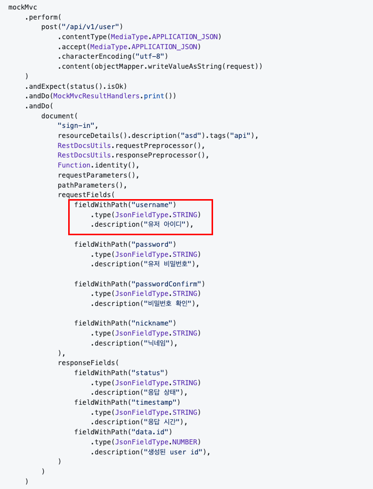
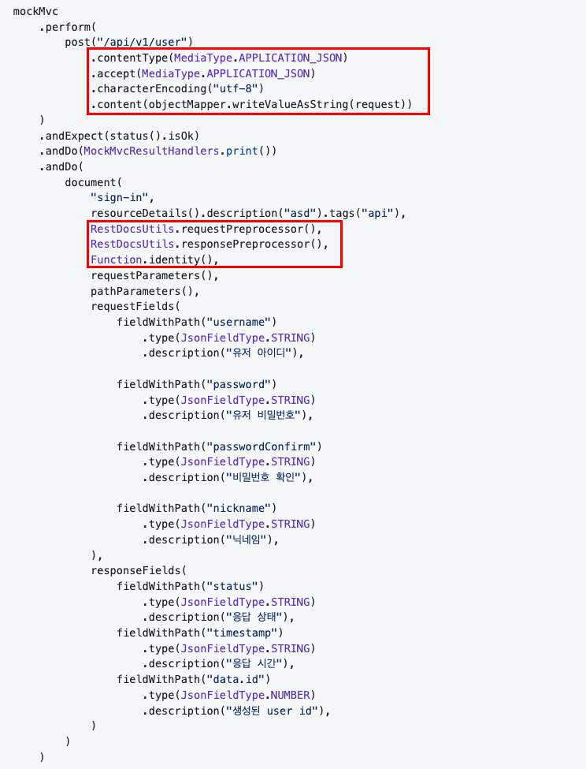

Spring에서 제공하는 API 문서 제작 도구 `Spring Rest Docs`를 사용하다 보면 여려분은 다음과 같은 코드를 많이 접하게 될 것입니다.

~~~ Kotlin
@Test
fun `회원가입 API`() {

    val request = SignInRequest(
        username = "username",
        password = "raw password",
        passwordConfirm = "raw password",
        nickname = "nickname"
    )

    every { userService.appendNormalUser(any(), any()) } returns 1L
    every { passwordEncoder.encode(any()) } returns "encoded password"

    mockMvc
        .perform(
            post("/api/v1/user")
                .contentType(MediaType.APPLICATION_JSON)
                .accept(MediaType.APPLICATION_JSON)
                .characterEncoding("utf-8")
                .content(objectMapper.writeValueAsString(request))
        )
        .andExpect(status().isOk)
        .andDo(MockMvcResultHandlers.print())
        .andDo(
            document(
                "sign-in",
                resourceDetails().description("회원가입 API 입니다.").tags("user"),
                RestDocsUtils.requestPreprocessor(),
                RestDocsUtils.responsePreprocessor(),
                Function.identity(),
                requestParameters(),
                pathParameters(),
                requestFields(
                    fieldWithPath("username")
                        .type(JsonFieldType.STRING)
                        .description("유저 아이디"),

                    fieldWithPath("password")
                        .type(JsonFieldType.STRING)
                        .description("유저 비밀번호"),

                    fieldWithPath("passwordConfirm")
                        .type(JsonFieldType.STRING)
                        .description("비밀번호 확인"),

                    fieldWithPath("nickname")
                        .type(JsonFieldType.STRING)
                        .description("닉네임"),
                ),
                responseFields(
                    fieldWithPath("status")
                        .type(JsonFieldType.STRING)
                        .description("응답 상태"),
                    fieldWithPath("timestamp")
                        .type(JsonFieldType.STRING)
                        .description("응답 시간"),
                    fieldWithPath("data.id")
                        .type(JsonFieldType.NUMBER)
                        .description("생성된 user id"),
                )
            )
        )
}
~~~

흔히 볼 수 있는 코드이기에 전혀 이상함을 느끼지 못하는 분들도 계실 것입니다.  

하지만 위와 같은 방법으로 직접 API 문서를 제작하다 보면 끊임없이 반복되는 복사 붙혀 넣기와, 
늘어나는 코드 라인에 API 문서 제작이 두려워지기도 하였습니다.

이번 포스팅에서는 이런 부정적인 Spring Rest Docs의 문서 제작 경험을 다음과 같이 `Kotlin Dsl`을 이용해 더욱 긍정적으로 개선한 경험에 대해 공유해 보겠습니다.

~~~ kotlin
@Test
fun `사용자 회원 가입 API`() {
    every { userService.appendNormalUser(any(), any()) } returns 1L
    every { passwordEncoder.encode(any()) } returns "encoded password"

    val api = api.post("/api/v1/user") {
        requestBody(
            SigninRequest(
                username = "username",
                password = "raw password",
                passwordConfirm = "raw password",
                nickname = "nickname"
            )
        )
    }

    documentFor(api, "user-sign-up") {
        summary("사용자 회원 가입 API")
        requestFields(
            "username" isTypeOf STRING whichMeans "유저가 사용하는 ID",
            "password" isTypeOf STRING whichMeans "비밀번호",
            "passwordConfirm" isTypeOf STRING whichMeans "비밀번호 확인",
            "nickname" isTypeOf STRING whichMeans "닉네임",
        )
        responseFields(
            "data.id" isTypeOf NUMBER whichMeans "생성된 유저의 ID"
        )
    }
}
~~~

  

## Kotlin의 Dsl

`DSL`(Domain-Specific Language)은 '도메인 전용 언어'로   
특정 비즈니스 도메인의 문제를 해결하려고 만든 작고 범용적이지 않은 특정 도메인을 대상으로 만든 특수 프로그래밍 언어입니다.

그 대표적인 예시로는 SQL, Java의 stream api 등이 습니다.   
코틀린에서는 mockk가 다음과 같이  dsl을 적극적으로 활용하고 있는 것을 볼 수 있습니다.

~~~ kotlin
every { userService.appendUser(any(), any()) } returns 1L
~~~

 

코틀린은 DSL을 구현하기 위해 `infix`라는 키워드를 제공하고 있습니다.

~~~ kotlin
infix fun String.isTypeOf(type: FieldType): DocumentField {
    return DocumentField(this, type)
}
~~~

infix 함수는 위와 같이 선언할 수 있으며, 다음과 같은 방법으로 사용할 수 있습니다.

~~~ kotlin
"username" isTypeOf STRING
~~~

선언부의 infix를 제외하고 살펴보면 함수의 역할을 더욱 직관적으로 확인할 수 있으며, 아래와 동일한 역할을 수행합니다.

~~~ kotlin
"username".isTypeOf(STRING)
~~~

  

## Kotlin Dsl Rest Docs

이제 이 infix 함수를 이용해 Sring Rest Docs를 개선해 보겠습니다.

 

### 문서 선언부

가장 먼저 개선해야 할 부분은 이곳입니다.

꽤나 직관적이고 이대로 사용해도 큰 문제없어 보입니다.  
하지만 앞서 언급한 코틀린의 infix 함수를 사용해 더욱 직관적으로 바꿔보겠습니다.

 

~~~ kotlin
data class DocumentField(
    val identifier: String,
    val type: FieldType,
    var description: String = "",
    var required: Boolean = true,
    val enumValues: String = ""
)
~~~

먼저 Field 영역에 필요한 정보를 담은 data 클래스를 정의해 줍니다. 식별자, 타입, 설명, 필수 여부, enum의 경우 그 값 이 이에 해당합니다.

 

~~~ kotlin
infix fun String.isTypeOf(type: FieldType): DocumentField {
    return DocumentField(this, type)
}

infix fun <T : Enum<T>> String.isTypeOf(enumType: ENUM<T>): DocumentField {
    return DocumentField(
        identifier = this,
        type = enumType,
        enumValues = enumType.entries.toString()
    )
}

infix fun DocumentField.whichMeans(description: String): DocumentField {
    return DocumentField(this.identifier, this.type, description)
}

infix fun DocumentField.required(required: Boolean): DocumentField {
    return DocumentField(this.identifier, this.type, description, required)
}
~~~

DocumentField 인스턴스를 생성할 수 있는 infix 함수를 정의해 줍니다. 
설명과 필수 유무는 반드시 들어가야 하는 값은 아니기 때문에 infix 함수를 한번 더 사용해 선택적으로 추가할 수 있도록 해줍니다.

이제 다음과 같은 방법으로 DocumentField를 생성할 수 있습니다. 단순 영어 문장을 읽는 것처럼 편안하게 읽을 수 있게 되었습니다.

 

~~~ kotlin
"username" isTypeOf STRING // 이름, 타입만 존재하는 경우
"username" isTypeOf STRING whichMeans "사용자의 아이디" // 이름, 타입, 설명이 존재하는 경우
"username" isTypeOf STRING whichMeans "사용자의 아이디" required true // 이름, 타입, 설명, 필수 유무가 모두 존재하는 경우
~~~

코드가 아닌 영어 문장을 읽는 것과 같은 느낌을 받을 수 있습니다.

 

~~~ kotlin
fun toFieldDescriptor(): FieldDescriptor {
    val descriptor = PayloadDocumentation.fieldWithPath(identifier)
        .type(type.value)
        .description(description + enumValues)
    if (!required) {
        descriptor.optional()
    }
    return descriptor
}
~~~

내 마음대로 생성할 수 있게 되었으니, Spring Rest Docs가 필요로 하는 `FieldDescriptor`클래스로 변환해 주는 메서드를 작성해 줍니다.

같은 방법으로 queryParameter, pathParameter, header를 생성할 수 있는 클래스도 만들어 주었습니다.

  

### 중복 제거와 구조 변경

다음 개선점은 중복과 구조 변경입니다.  
기존에는 모든 API를 문서화할 때 마다 아래 사진의 빨간 네모 부분을 무조건 추가해야만 했습니다.

또한 큰 불편함을 느끼진 않았지만, `mockMvc.perform(...).andDo(document(...))`와 같이 API호출 부분과 문서 작성 부분이 체이닝 되어 있어 이 두 부분을 분리하고자 하였습니다.

  

### API호출

먼저 API호출 부분입니다.

~~~ kotlin
class MockMvcApiRequestBuilder(
    method: HttpMethod,
    path: String,
    pathParameters: Array<out Any>
) : ApiRequestBuilder {

    private val builder: MockHttpServletRequestBuilder

    init {
        builder = httpMethodOf(method, path, pathParameters)
            .contentType(MediaType.APPLICATION_JSON)
            .accept(MediaType.APPLICATION_JSON)
            .characterEncoding("utf-8")
    }

    override fun requestHeader(
        key: String,
        value: String
    ): ApiRequestBuilder {
        builder.header(key, value)
        return this
    }

    override fun queryParam(
        key: String,
        value: String
    ): ApiRequestBuilder {
        builder.queryParam(key, value)
        return this
    }

    override fun requestBody(
        body: Any
    ): ApiRequestBuilder {
        builder.content(JsonSerializer.serialize(body))
        return this
    }

    fun build(mockMvc: MockMvc): ResultActions {
        return mockMvc.perform(builder)
    }

    private fun httpMethodOf(
        method: HttpMethod,
        path: String,
        pathParameters: Array<out Any>,
    ): MockHttpServletRequestBuilder {
        return when (method) {
            GET -> RestDocumentationRequestBuilders.get(path, *pathParameters)
            POST -> RestDocumentationRequestBuilders.post(path, *pathParameters)
            PATCH -> RestDocumentationRequestBuilders.patch(path, *pathParameters)
            PUT -> RestDocumentationRequestBuilders.put(path, *pathParameters)
            DELETE -> RestDocumentationRequestBuilders.delete(path, *pathParameters)
        }
    }
}
~~~

앞서 언급한 중복 코드 제거를 위해 Mockito가 제공하는 `MockHttpServletRequestBuilder`를 
`MockMvcApiRequestBuilder`로 감싸 초기화 블록에 중복 코드를 넣었습니다.  

또 이 단계에서 요청 객체를 직렬화해줌으로써 매번 `objectMapper.writeValueAsString()`를 호출해야 하는 번거로움을 없앨 수 있게 되었습니다.

`build()` 메서드를 통해 실행되며 `mockMvc.perform()`을 그대로 반환하기 때문에 이 메서드의 반환값을 체이닝 하여 문서 제작 로직을 수행할 수 있습니다.

 

이 RequestBuilder는 아래 MethodSelector를 통해 `api.get()`과 같은 방법으로 호출할 수 있습니다.

~~~kotlin
class MockMvcApiMethodSelector(
    val applyAction: (
        requestBuilder: MockMvcApiRequestBuilder,
        buildAction: ApiRequestBuilder.() -> Unit
    ) -> ResultActions
) : ApiMethodSelector {

    override fun get(
        path: String,
        vararg pathParameters: Any,
        buildAction: ApiRequestBuilder.() -> Unit
    ): ResultActions {
        val requestBuilder = MockMvcApiRequestBuilder(GET, path, pathParameters)
        return applyAction(requestBuilder, buildAction)
    }

    // post(), put(), patch(), delete() ...
}

~~~

  

### 문서 생성

문서 생성 부분도 동일하게 `MockMvcRestDocumentationWrapper.document()`를 `MockMvcApiDocumentGenerator`로 감싸는 것으로 중복을 제거하였습니다.

~~~ kotlin 
class MockMvcApiDocumentGenerator : ApiDocumentGenerator {

    override fun generate(context: ApiDocumentContext): ResultHandler {
        return MockMvcRestDocumentationWrapper.document(
            context.identifier,

            context.toResourceDetail(context),

            DocumentUtil.requestPreprocessor(),
            DocumentUtil.responsePreprocessor(),

            DocumentUtil.snippetFilter(),

            *context.snippets
        )
    }
}
~~~

여기서 context는 API 문서에 필요한 모든 구성요소의 집합으로 다음과 같이 구성되어 있으며, builder를 통해 생성됩니다.

~~~ kotlin
data class ApiDocumentContext(
    val identifier: String1,
    val summary: DocumentSummary,
    val guide: DocumentGuide,
    val enums: List<DocumentEnum>,
    val errors: List<DocumentError>,
    val pathParameters: List<DocumentCommonEntity>,
    val queryParameters: List<DocumentCommonEntity>,
    val requestHeaders: List<DocumentCommonEntity>,
    val requestFields: List<DocumentField>,
    val responseHeaders: List<DocumentCommonEntity>,
    val responseFields: List<DocumentField>,
    val commonResponseFields: List<DocumentField>,
) {

    val snippets: Array<Snippet>
        get() {
            val snippets = mutableListOf<Snippet>()

            if (pathParameters.isNotEmpty()) snippets.add(toPathParameterSnippet())
            if (queryParameters.isNotEmpty()) snippets.add(toRequestParameterSnippet())
            if (requestHeaders.isNotEmpty()) snippets.add(toRequestHeaderSnippet())
            if (requestFields.isNotEmpty()) snippets.add(toRequestFieldSnippet())
            if (responseHeaders.isNotEmpty()) snippets.add(toResponseHeaderSnippet())
            if (allResponseFields.isNotEmpty()) snippets.add(toResponseFieldSnippet())

            return snippets.toTypedArray()
        }

    // ...
}

~~~

  

### 통합

이렇게 구현한 클래스들은 `MockMvcApiDocsTest`라는 추상클래스를 통해 사용자에게 제공됩니다.

~~~ kotlin
@TestConstructor(autowireMode = TestConstructor.AutowireMode.ALL)
@AutoConfigureRestDocs
abstract class MockMvcApiDocsTest : ApiDocsTest {

    protected val api = MockMvcApiMethodSelector { requestBuilder, buildAction ->
        requestBuilder.apply(buildAction).build(mockMvc())
    }

    override fun documentFor(
        resultAction: ResultActions,
        identifier: String,
        action: ApiDocumentContextBuilder.() -> Unit
    ) {
        val builder = ApiDocumentContextBuilder(identifier, tag(), commonResponseField())
        val context = builder.apply(action).build()
        val documentGenerator = MockMvcApiDocumentGenerator()
        resultAction.andDo(documentGenerator.generate(context))
    }

    abstract fun mockMvc(): MockMvc
}
~~~

사용자의 테스트 환경에 맞게 mockMvc를 구성할 수 있도록 추상 메서드로 제공하고 있습니댜.

`api`를 통해 API를 구성하고, 그 반환값을 `documentFor()`에 제공하는 것으로 API에 대한 문서를 작성하고 있습니다.

 

이제 이 추상 클래스를 활용해 더욱 깔끔하고 직관적인 spring rest docs를 작성할 수 있게 되었습니다.

~~~ kotlin
@Test
fun `사용자 회원 가입 API`() {
    every { userService.appendNormalUser(any(), any()) } returns 1L
    every { passwordEncoder.encode(any()) } returns "encoded password"

    val api = api.post("/api/v1/user") {
        requestBody(
            SigninRequest(
                username = "username",
                password = "raw password",
                passwordConfirm = "raw password",
                nickname = "nickname"
            )
        )
    }

    documentFor(api, "user-sign-up") {
        summary("사용자 회원 가입 API")
        requestFields(
            "username" isTypeOf STRING whichMeans "유저가 사용하는 ID",
            "password" isTypeOf STRING whichMeans "비밀번호",
            "passwordConfirm" isTypeOf STRING whichMeans "비밀번호 확인",
            "nickname" isTypeOf STRING whichMeans "닉네임",
        )
        responseFields(
            "data.id" isTypeOf NUMBER whichMeans "생성된 유저의 ID"
        )
    }
}
~~~

 

`kotlin-dsl-rest-docs`의 모든 코드는 [깃허브 저장소](https://github.com/wwan13/kotlin-dsl-rest-docs)에서 확인할 수 있습니다.  
~~스타와, contribution은 언제나 환영입니다 ~!~~

[deskmood 저장소](https://github.com/Desk-Mood/deskmood-server/tree/main/deskmood-core/core-api/src/test/kotlin/org/deskmood/docs)에서 제가  `kotlin-dsl-rest-docs`를 어떻게 활용하고 있는지 확인하실 수 있습니다.