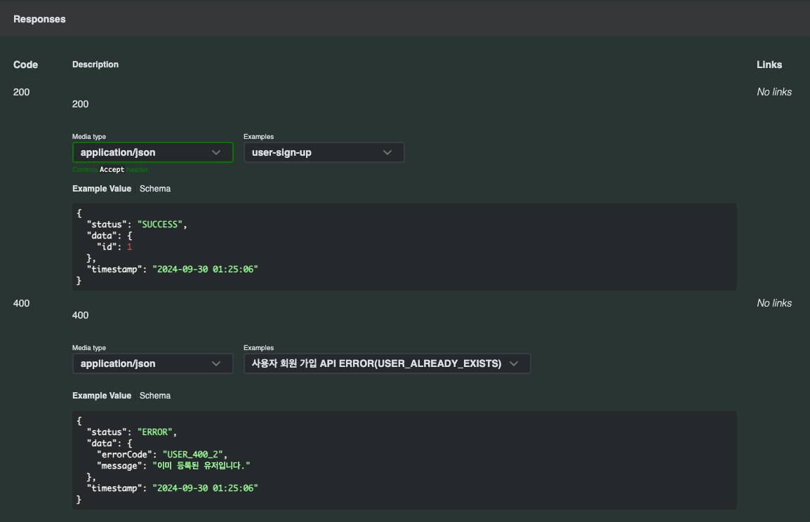
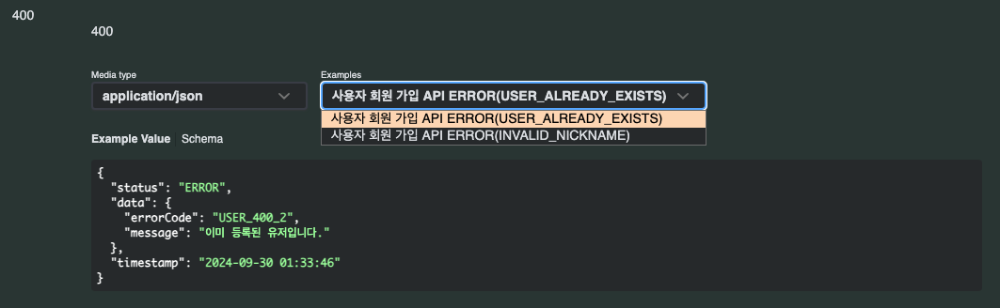
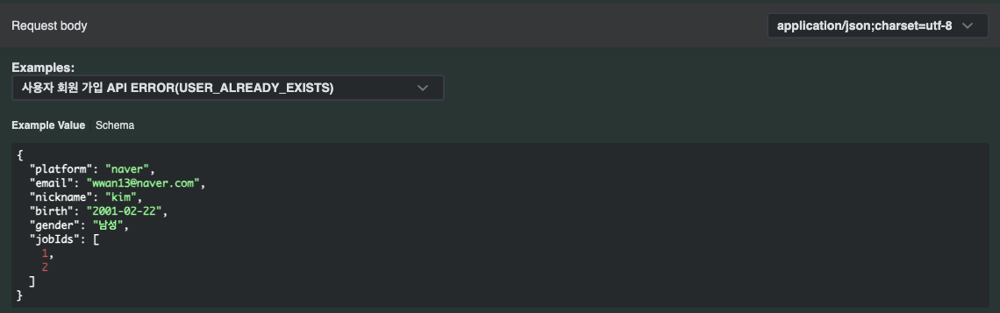
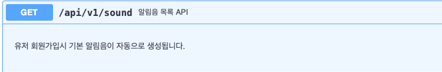
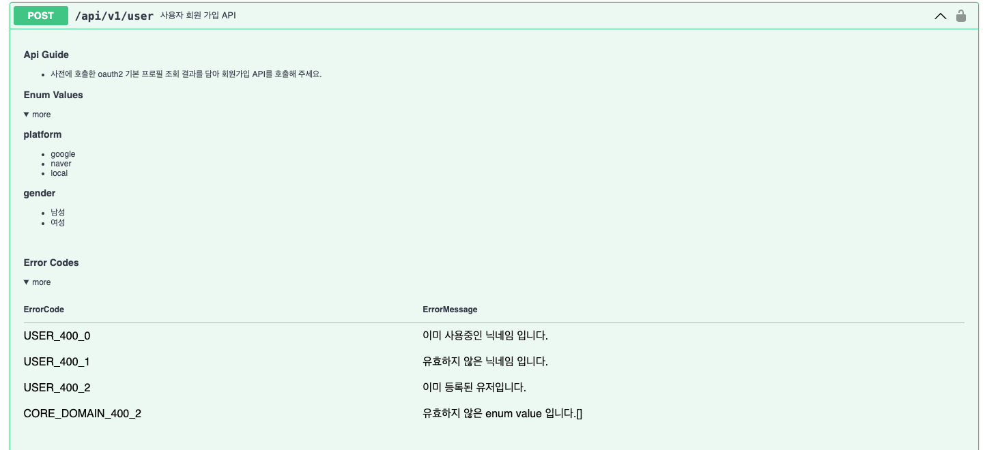

> API documentation is a technical content deliverable, containing instructions about how to effectively use and integrate with an API. 

 

[swagger](https://swagger.io/blog/api-documentation/what-is-api-documentation-and-why-it-matters/) 에서는 API 문서를
'API를 효과적으로 사용하고 통합하는 방법에 대한 지침을 포함하는 기술 콘텐츠'로 API의 정보, 반환값, 요청값 등을 포함하고 있는 것으로 소개하고 있습니다.

하지만 이것들 만으로는 'API를 사용하며 발생할 수 있는 여러 **예외 상황에 대한 지침**'은 제공할 수 없습니다.

서버에서 발생하는 여러 예외에 대한 분기를 클라이언트가 처리하기 위해 `Error Code`를 반환하는 방법을 사용하곤 합니다. 
이번 포스팅에서는 제가 OAS3를 사용하는 API문서에 에러 코드를 추가한 방법에 대해 공유해 보겠습니다.

_해당 포스팅은 [이전 포스팅](https://wwan13.github.io/1009/)에서 제작한 `kotlin-dsl-rest-docs`를 개선한 것으로 위 포스팅 혹은 [깃허브 저장소](https://github.com/wwan13/kotlin-dsl-rest-docs)를 참고하여 주세요._

  

## 첫 번째 방법 : 모든 에러 코드를 담은 컨트롤러 추가하기

처음 알게 된 방법은 모든 에러 코드를 반환하는 컨트롤러를 테스트 코드에 추가하는 방법입니다.   
_(직접 시도한 방법이 아니기 때문에 자세한 설명은 생략하겠습니다. [참고](https://0soo.tistory.com/210))_

`ENUM.entries()` 를 그대로 호출하기에 실수로 누락할 일도 없고, 한 눈에 모든 에러 코드를 확인할 수 있다는 장점이 있습니다.

하지만 저는 **API별 호출시 발생 가능한 에러 코드들의 모음**을 원했기 때문에, 모든 API에 대한 에러 코드의 모음인 이 방법은 적절하지 못했습니다.

  

## 두 번째 방법 : 예외 Example(Schema)추가하기

두 번째 방법은 정상적인 API에 대한 문서를 제공하는 것과 동일한 방법으로 에외 케이스에 대한 테스트 코드를 작성하는 것입니다.

~~~ kotlin
@Test
fun `사용자 회원 가입 API error USER_ALREADY_EXISTS`() {
    every { userService.appendUser(any(), any()) } throws CoreException(ErrorType.USER_ALREADY_EXISTS)

    val api = api.post("/api/v1/user") {
        requestBody(UserAppendRequest(...))
    }

    documentFor(api, "user-sign-up-error(USER_ALREADY_EXISTS)") {
        summary("사용자 회원 가입 API error USER_ALREADY_EXISTS")
        requestFields(
            "email" isTypeOf STRING whichMeans "이메일",
            "nickname" isTypeOf STRING whichMeans "닉네임",
            ...
        )
        responseFields(
            "data.errorCode" isTypeOf STRING whichMeans "발생한 에러 코드",
            "data.errorMessage" isTypeOf STRING whichMeans "발생한 에러 메세지"
        )
    }
}
~~~

기존 테스트코드에 위와 같이 예외 상황을 포함하는 새로운 테스트케이스를 추가한 뒤 문서를 생성하면 다음과 같은 결과를 얻을 수 있습니다.

 

200을 반환하는 정상적인 반환값 아래, 400의 예외 상황을 반환하는 필드가 추가된 것을 확인할 수 있습니다.

발생하는 예외가 여러 개인 경우 위와 같이 드롭다운을 통해 확인도 가능합니다.

 

하지만 이 방법에는 치명적인 단점이 존재하였습니다.

Examples의 알 수 없는 정렬 조건으로 간혹 위와 같이 에러 케이스가 대표 예제로 설정되는 것이었습니다.   
테스트 순서 조정, 에러 케이스의 앞에 특수문자 삽입 등 여러 방법을 시도해 보았으나 그 순서는 변하지 않았습니다.

사소한 문제로 넘어갈 수 있었지만, 프론트앤드 개발자가 잘못된 예제를 옳은 예제로 혼동할 가능성이 있다고 판단하여 이 방법도 사용하지 않기로 하였습니다.

  

## 마지막 방법 : Description의 Markdown문법 지원 활용

OAS3에는 API에 대한 자세한 설명을 더하기 위해 다음과 같은 Description 필드가 존재합니다.

 

단순 텍스트만 입력 가능한 줄 알았으나 놀랍게도 이 Description 필드에서 html과 markdown 를 모두 지원하고 있었습니다.   
따라서 저는 이 필드와 마크다운을 이용해 에러 코드를 추가해 보자 하였습니다.

 

### 구현하기

우선 문서화 대상인 에러코드와 에러메세지를 담은 클래스 생성 뒤 kotlin-dsl-rest-docs의 컨셉에 맞게 infix 함수도 추가해 줍니다.

~~~ kotlin
infix fun String.provideMessage(message: String): DocumentError {
    return DocumentError(this, message)
}
// EXAMPLE_ERROR_CODE provideMessage "예시 에러 코드 입니다."

data class DocumentError(
    val code: String,
    val message: String
)
~~~

 

선언한 에러코드들을 Desciption에서 사용할 수 있도록 MarkdonConverter라는 유틸 함수를 작성해 줍니다.

~~~ kotlin
object MarkdownConverter {

    fun convertErrors(errors: List<DocumentError>): String {
        return """
            |
            |### Error Codes
            |
            |

            |
 more 

            |
            ||ErrorCode|ErrorMessage|
            ||:---:|:---:|
            |${errors.joinToString("\n") { "|${it.code}|${it.message}|" }}
            |
            |

            |
        """.trimMargin()
    }

    fun join(values: List<String>): String {
        return values.joinToString(" ")
    }
}

~~~

 

기존 `summary.description`만 존재하던 필드에 마크다운으로 변환된 에러 코드를 추가해 줍니다.

~~~ kotlin
// ApiDocumentContext
val description: String
    get() {
        val elements = mutableListOf<String>()

        if (summary.hasDescription()) elements.add(summary.description)
        if (errors.isNotEmpty()) elements.add(MarkdownConverter.convertErrors(errors))

        return MarkdownConverter.join(elements)
    }
~~~

 

나아가 API에 포함된 ENUM을 담은 `DocumentEnum`과, API 설명을 ul의 형식으로 할 수 있도록 `DocumentGuide`도 추가하였습니다.

 

그 결과 다음과 같이 테스트를 작성하면 필요했던 모든 정보를 담은 풍족한 API 문서가 생성되는 것을 볼 수 있습니다.

~~~ kotlin
@Test
fun `사용자 회원 가입 API`() {
    // ..

    documentFor(api, "user-sign-up") {
        summary("사용자 회원 가입 API")
        guide(
            "사전에 호출한 oauth2 기본 프로필 조회 결과를 담아 회원가입 API를 호출해 주세요.",
        )
        containedEnums(
            "platform" hasValues OauthPlatform.entries.map { it.value },
            "gender" hasValues Gender.entries.map { it.value }
        )
        expectedError(
            "USER_400_0" providesMessage "이미 사용중인 닉네임 입니다.",
            "USER_400_1" providesMessage "유효하지 않은 닉네임 입니다.",
            "USER_400_2" providesMessage "이미 등록된 유저입니다.",
            "CORE_DOMAIN_400_2" providesMessage "유효하지 않은 enum value 입니다"
        )
        requestFields(
            "platform" isTypeOf ENUM(OauthPlatform::class) whichMeans "oauth2 플랫폼 (naver/google)",
            "email" isTypeOf STRING whichMeans "이메일",
            "gender" isTypeOf ENUM(Gender::class) whichMeans "성별 (남성/여성)",
            // ...
        )
        responseFields(
            "data.id" isTypeOf NUMBER whichMeans "생성된 유저의 ID"
        )
    }
}
~~~

 

 

`kotlin-dsl-rest-docs`의 모든 코드는 [깃허브 저장소](https://github.com/wwan13/kotlin-dsl-rest-docs)에서 확인할 수 있습니다.  
~~스타와, contribution은 언제나 환영입니다 ~!~~

[deskmood 저장소](https://github.com/Desk-Mood/deskmood-server/tree/main/deskmood-core/core-api/src/test/kotlin/org/deskmood/docs)에서 제가  `kotlin-dsl-rest-docs`를 어떻게 활용하고 있는지 확인하실 수 있습니다.